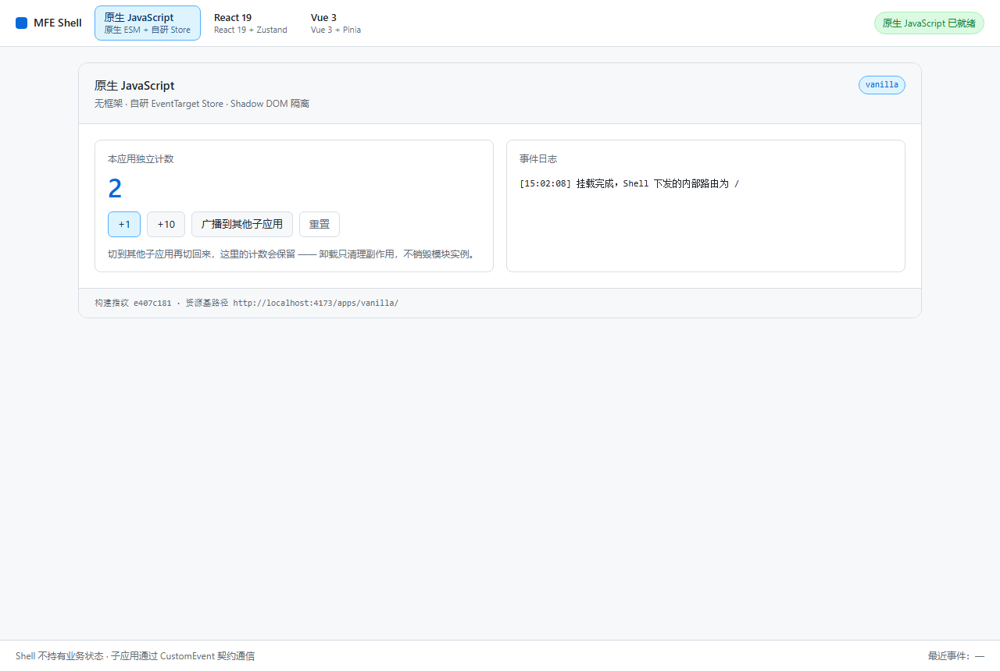
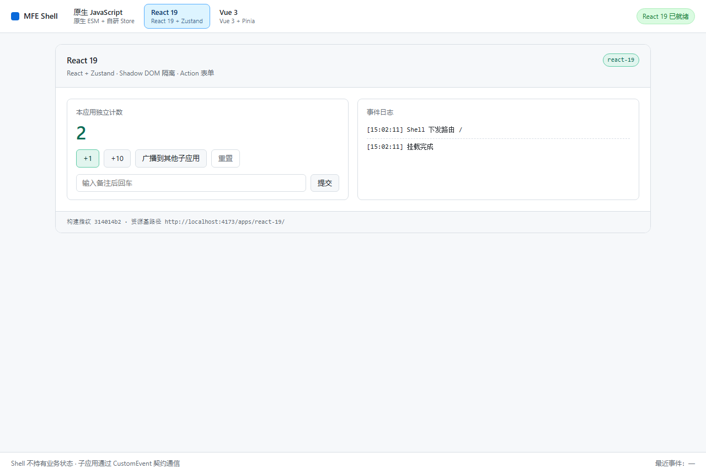
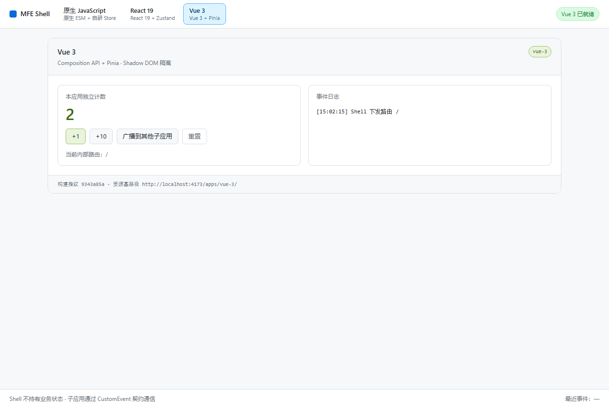
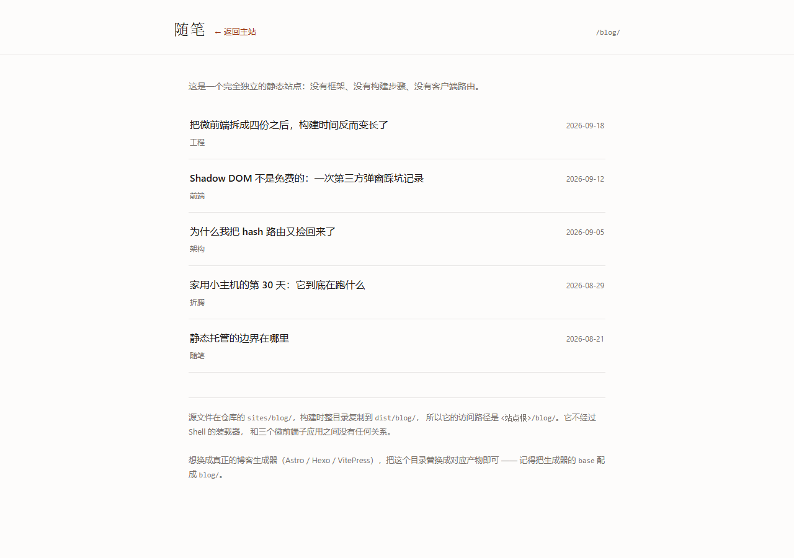
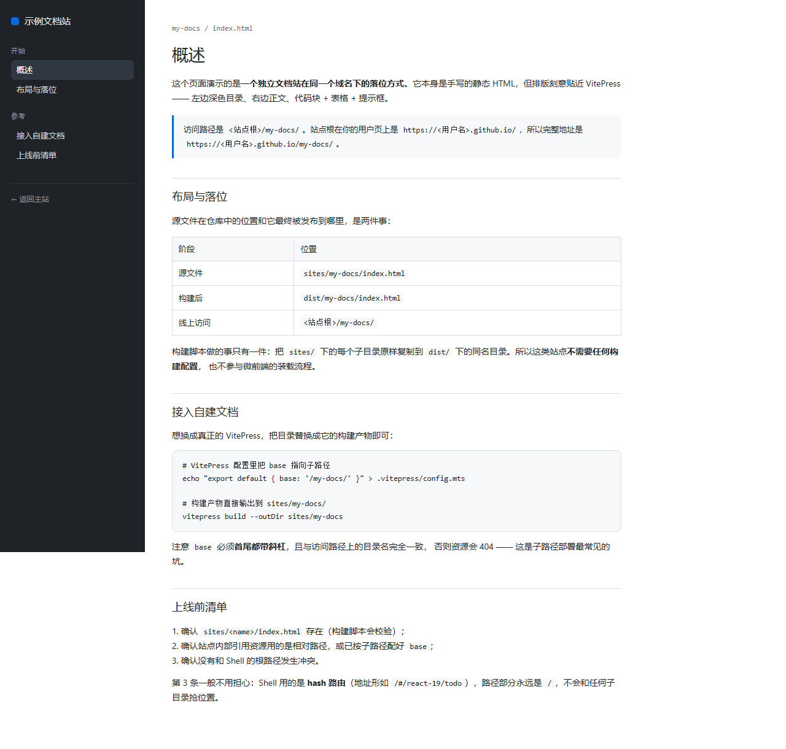
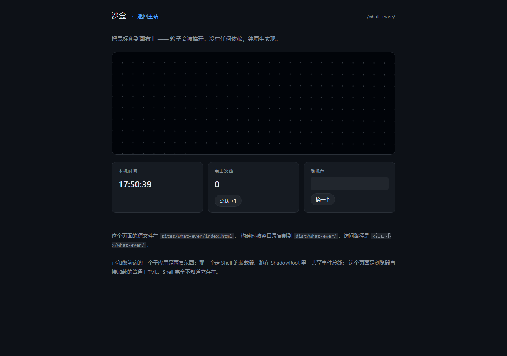

# 微前端模板（GitHub Pages · 原生 ESM 契约）

一套可直接部署到 GitHub Pages 的微前端项目模板：Shell 主应用负责路由与装载，三个技术栈互相独立的子应用各自构建、各自管理状态，运行时通过 Shadow DOM 与 ESM 模块作用域隔离。

| 子应用 | 技术栈 | 状态管理 | 构建产物 |
| --- | --- | --- | --- |
| `shell` | Vite + TypeScript（**无框架运行时**） | 无业务状态，仅路由与装载 | `dist/index.html` |
| `apps/vanilla` | 原生 JavaScript（ESM） | 自研 `EventTarget` + 不可变快照 store | `dist/apps/vanilla/` |
| `apps/react-19` | React 19 + TSX | Zustand | `dist/apps/react-19/` |
| `apps/vue-3` | Vue 3 + SFC | Pinia（每个子应用独立 `createPinia()`） | `dist/apps/vue-3/` |
| `packages/contract` | 纯 TypeScript 类型（零运行时） | — | 不产出，编译期擦除 |

## 运行效果

| 原生 JavaScript + 自研 Store | React 19 + Zustand | Vue 3 + Pinia |
| --- | --- | --- |
|  |  |  |

三个子应用各自拥有独立的视觉风格与状态容器；顶栏右侧状态胶囊显示当前装载状态，页脚的**事件总线面板**实时展示所有跨应用事件（含发送方、类型、负载、时间），并可一键清空。

顶栏右侧还有一组**「其他站点」**入口 —— 它们是与微前端完全无关的独立静态子站，见[第 7 节](#7-独立静态子站sites)。

---

## 1. 快速开始

包管理器固定为 **pnpm**（版本由根 `package.json` 的 `packageManager` 字段锁定为 `pnpm@12.4.2`，CI 与本地一致）。若本机没有 pnpm：

```bash
corepack enable pnpm    # Node 20+ 自带 corepack，推荐
# 或： npm i -g pnpm
```

```bash
pnpm install           # 安装依赖（会生成 pnpm-lock.yaml）
pnpm run typecheck     # 可选：全量类型检查
pnpm run build         # 完整构建，产物合并到 dist/
pnpm run preview       # 本地预览生产产物 → http://localhost:4173/
```

开发：

```bash
pnpm run dev            # 集成模式：Shell (HMR) + 三个子应用产物监听
pnpm run dev:vanilla    # 独立开发原生子应用 → http://localhost:5174/
pnpm run dev:react      # 独立开发 React 子应用 → http://localhost:5175/
pnpm run dev:vue        # 独立开发 Vue 子应用    → http://localhost:5176/
```

> **独立模式**用 `tools/dev-host.ts` 复刻了 Shell 的 Shadow DOM 环境（含把 Vite 注入 `document.head` 的样式搬进 ShadowRoot），因此在单应用里就能提前发现隔离相关问题。
> **集成模式**下 Shell 加载的始终是真实构建产物，与线上行为完全一致，不会出现「dev 正常、部署后白屏」。

---

## 2. 目录结构

```
.
├─ pnpm-workspace.yaml         ★ workspace 定义 + esbuild 安装脚本放行
├─ pnpm-lock.yaml              ★ 必随代码提交，CI 用 --frozen-lockfile 校验
├─ shell/                      Shell 主应用
│  ├─ src/registry.ts          ★ 子应用注册表：新增子应用只需改这里
│  ├─ src/router.ts            hash 路由解析： #/<appId>/<内部路由>
│  ├─ src/loader.ts            装载器：manifest → 样式 → 动态 import → mount → 离线回放
│  ├─ src/bus.ts               CustomEvent 事件总线（支持通配订阅与历史回放）
│  ├─ src/shadow-base.css      注入每个 ShadowRoot 的基础样式与设计变量
│  └─ src/shell.css            Shell 自身样式（只作用于 light DOM）
├─ apps/
│  ├─ vanilla/src/{mfe.ts,store.ts,app-store.ts,view.ts}
│  ├─ react-19/src/{mfe.tsx,App.tsx,store.ts}
│  └─ vue-3/src/{mfe.ts,App.vue,stores/counter.ts}
├─ packages/contract/src/index.ts   ★ 唯一契约：MfeMountContext / MicroAppModule / MfeBus
├─ sites/                      独立静态子站（不参与构建，整目录复制到 dist/<name>/）
│  ├─ blog/index.html          博客列表示例
│  ├─ my-docs/index.html       文档站示例（VitePress 风格）
│  └─ what-ever/index.html     沙盒示例（Canvas 粒子 + 交互）
├─ tools/
│  ├─ mfe-manifest.ts          构建期生成 manifest.json 的 Vite 插件
│  ├─ dev-host.ts              独立开发用的 Shadow DOM 宿主
│  └─ workspace.mjs            脚本公共工具（包管理器探测、进程托管）
├─ scripts/                    build / dev / preview / typecheck / clean
├─ .github/workflows/deploy.yml
└─ dist/                       ★ 构建产物：Shell 与三个子应用合并为一份可部署目录
```

---

## 3. 架构与隔离机制

```
       ┌──────────────────────────────────────────────┐
       │ Shell   hash 路由 · 布局 · 装载器 · 事件总线   │  无业务状态
       └───────────────┬──────────────────────────────┘
                       │ 动态 import() 子应用 ESM 入口
       ┌───────────────┴───────────────┬───────────────┐
       ▼                               ▼               ▼
  ┌─────────┐                    ┌──────────┐    ┌─────────┐
  │ vanilla │                    │ react-19 │    │  vue-3  │
  │ 各自 ESM │                    │ 各自 ESM  │    │ 各自 ESM │
  │ 各自 Store│                   │ 各自 Store│    │ 各自 Store│
  └────┬────┘                    └────┬─────┘    └────┬────┘
       └────────── CustomEvent 事件总线 ──────────────┘
                    （唯一允许的通信通道）
```

### 三层隔离分别由什么保证

| 维度 | 机制 | 落地位置 |
| --- | --- | --- |
| **DOM / 样式** | 每个子应用一个 `ShadowRoot`，Shell 全局样式进不来，子应用样式也出不去 | `shell/src/loader.ts` 的 `attachShadow` |
| **JavaScript** | 子应用是彼此独立的 ESM 模块图，各自打包自己的框架与状态库，靠**不写 `window` 全局变量**的约定互不干扰 | `packages/contract` 的接口约定 |
| **状态** | 每个子应用的 store 都定义在自己的模块图内。Shell 与 `MfeMountContext` 里**没有任何共享 store**，只给只读 `env` 与事件总线 | 三个子应用的 `store.ts` / `stores/` |

> 这是刻意的取舍：**不做 Proxy 沙箱**。三个异构技术栈之间没有值得共享的运行时依赖，沙箱带来的复杂度换不来实际收益。如果后续确需「物理级」隔离，可以直接替换 `shell/src/loader.ts` 的装载实现（换成 wujie 或 iframe），子应用代码一行都不用改 —— 因为契约是 `mount/unmount`，与装载方式无关。

### 子应用生命周期

每个子应用的 ESM 入口必须导出：

```ts
export function mount(ctx: MfeMountContext): void | Promise<void>
export function unmount(): void | Promise<void>
export function update?(ctx: { route: string }): void | Promise<void>   // 可选
```

Shell 的调度规则：

| 场景 | Shell 行为 |
| --- | --- |
| 首次进入子应用 | `mount(ctx)`，随后补投离线期间的跨应用事件 |
| hash 内部路由变化（如 `#/react-19/a` → `#/react-19/b`） | 有 `update` 就调 `update({route})`，否则退化为 `unmount` + `mount` |
| 切到别的子应用 | `unmount()`，宿主节点隐藏但**不销毁** |
| 再切回来 | 直接复用已加载的模块实例，重新 `mount(ctx)`，并补投它离线期间错过的事件 |

因此 **`unmount` 只负责清理副作用（定时器、总线订阅、第三方实例），不负责清空业务状态**。三个子应用各自切来切去，计数互不影响，也不会互相清零。

`unmount` 里必须做三件事（模板已示范）：

1. 取消所有事件总线订阅（`ctx.bus.on(...)` 返回的函数）；
2. 销毁框架实例（`root.unmount()` / `app.unmount()`）；
3. 移除本次 mount 创建的宿主节点。

---

## 4. 跨应用通信与状态管理约定（必须遵守）

### 状态

- **每个子应用的 store 只属于自己。** 不要把它提升成"微前端全局 store"，也不要把 Shell 做成状态中枢。
- **跨应用数据一律走事件，不走共享对象。** `ctx.bus.emit()` / `ctx.bus.on()` 是唯一通道。
- **事件不会回传给发送者自身**，避免自己 emit 又触发自己的 handler 形成回声循环。
- **事件 payload 不要就地修改。** 所有订阅者拿到同一份 `detail` 引用，要派生数据请先拷贝。
- Shell 侧不存业务状态。它只提供：路由、只读 `env`（`appId` / `baseUrl` / `hash` / `builtAt`）、事件总线。

事件命名建议 `域:动作`，例如模板里的 `counter:changed`。

### 事件的真实语义：它传递的是「你不在场时发生过什么」

**同一时刻只有一个子应用处于挂载状态**（这是本模板的布局决定的：切走的应用会被 `unmount`，而 `unmount` 必须取消总线订阅，否则就是内存泄漏 + 越权处理）。

所以「A 广播时 B 不在线」不是异常，而是常态。为了让跨应用通信真正有意义，Shell 充当**中立方**：缓存最近的跨应用事件，并在任意子应用挂载后把它离线期间错过的部分补投一遍，这些事件的 `replayed` 为 `true`。

```
1. 在 vanilla 点「广播到其他子应用」
   ├─ Shell 收到  →  写入页脚事件总线面板 + 进入缓存（最近 20 条）
   └─ react-19 / vue-3 此刻并未挂载，收不到

2. 切到 react-19
   └─ Shell 在该应用 mount 完成后补投缓存命中项
      → react-19 日志出现「离线期间：vanilla 曾广播计数 3」

3. 再切回 vanilla 广播一次，然后切到 vue-3
   └─ vue-3 同样能看到它离线期间错过的那些消息
```

**写 handler 时必须注意**：`replayed: true` 的事件是历史消息，不是刚刚发生的。副作用敏感的逻辑（例如「收到事件就发请求」「收到事件就弹提示」）应当跳过回放，否则会把历史动作重放一遍：

```ts
ctx.bus.on('order:created', (event) => {
  if (event.replayed) return        // 历史消息：只更新展示，不触发副作用
  void refreshOrders()
})
```

补充说明：

- 补投发生在 `mount()` 返回后的下一个事件循环（延迟 50ms）。原因是 React 的 `useEffect` 由调度器异步 flush，同步回放会赶在订阅注册之前、被静默丢弃。
- 每个子应用有独立的投递水位线，只补投「上次离线之后」的事件，切来切去不会重复灌历史。
- Shell 缓存上限 20 条，页脚的「清空」按钮会同时清空缓存 —— 清空之后新挂载的子应用不会再收到更早的消息。
- `bus.on('*', handler)` 是通配订阅，会收到所有类型的事件。Shell 内部用它做缓存与面板展示，子应用一般只需订阅自己关心的事件类型。

如果你想改成「切走后也持续接收事件」，不要靠删除 `unmount` 里的取消订阅来实现（会泄漏），正确做法是把长驻逻辑放在 Shell 侧或独立的 Worker 里。

---

## 5. 构建产物与缓存策略

GitHub Pages 是静态托管 + CDN，**无法主动 purge 缓存**，因此产物分两类处理：

```
dist/index.html                Shell 入口
dist/assets/<name>-<hash>.js   Shell 资源（content hash，可长期缓存）
dist/apps/<id>/index.js        子应用入口（固定文件名）
dist/apps/<id>/manifest.json   子应用产物清单（含构建指纹 hash）
dist/apps/<id>/assets/*.js     子应用内部 chunk（content hash，可长期缓存）
```

运行时流程：

```
Shell → fetch  apps/<id>/manifest.json?t=<时间戳>   （no-store，永远拿到最新）
      → 注入 <link> 样式到 ShadowRoot
      → import(apps/<id>/index.js?v=<manifest.hash>) （hash 变化即绕过 CDN 缓存）
      → mount() → 补投离线事件
```

`manifest.json` 由 `tools/mfe-manifest.ts` 在各子应用构建结束时自动生成，无需手工维护。

---

## 6. 新增一个子应用

以新增 `apps/svelte` 为例：

1. 复制 `apps/vanilla` 作为起点，改 `package.json` 的 `name`，并加上 `"@mfe/contract": "workspace:*"` 依赖；
2. 改 `vite.config.ts` 里的 `NAME = 'svelte'`、`lib.entry`、`server.port`；
3. 实现 `src/mfe.ts`，导出 `mount` / `unmount`（`update` 可选），
   并 `import './style.css'` —— 样式会被打进同一个 css 文件，由 Shell 注入 ShadowRoot；
4. 在 `tools/workspace.mjs` 的 `PACKAGES` 里加一行；
5. 在 `shell/src/registry.ts` 的 `APPS` 里加一项：

```ts
{
  id: 'svelte',
  title: 'Svelte',
  stack: 'Svelte 5 + Runes',
  dir: 'apps/svelte/',
  defaultRoute: '/'
}
```

6. 在根 `package.json` 加一条 `dev:svelte` 脚本（可选）；
7. `pnpm run build`，产物会自动进入 `dist/apps/svelte/`。

> `pnpm-workspace.yaml` 用的是 `apps/*` 通配，新增一级子目录无需改动它。

---

## 7. 独立静态子站（sites/）

除了微前端子应用，仓库还能承载**任意多个完全独立的静态站点**。它们与微前端运行时互不相干，只是和 Shell 一起发布在同一个域名下：

| 子站 | 访问路径 | 内容 |
| --- | --- | --- |
| `sites/blog/` | `<站点根>/blog/` | 纯手写博客列表，零依赖零构建 |
| `sites/my-docs/` | `<站点根>/my-docs/` | VitePress 风格文档站，演示子路径落位 |
| `sites/what-ever/` | `<站点根>/what-ever/` | Canvas 粒子沙盒 + 交互演示 |

| blog | my-docs | what-ever |
| --- | --- | --- |
|  |  |  |

### 它和微前端子应用的区别

| | 微前端子应用（`apps/`） | 静态子站（`sites/`） |
| --- | --- | --- |
| 加载方式 | Shell 装载器动态 `import()` + Shadow DOM 挂载 | 浏览器直接加载普通 HTML |
| 参与事件总线 | 是 | 否，Shell 不知道它存在 |
| 需要构建 | 需要（Vite lib 模式 + manifest） | 不需要，整目录复制 |
| 源码 / 产物 | `apps/<id>/` → `dist/apps/<id>/` | `sites/<name>/` → `dist/<name>/` |

### 新增一个静态子站

1. 在 `sites/` 下新建目录（例如 `sites/notes/`），里面放一个 `index.html` —— 入口必须叫这个名字，构建脚本会校验；
2. `pnpm run build`，脚本会把 `sites/*` 整目录复制到 `dist/*`；
3. 想让它出现在 Shell 顶栏，在 `shell/index.html` 的「其他站点」导航里加一个链接即可。

> 开发模式（`pnpm run dev`）下这些路径同样可访问：Shell 的开发中间件按目录名**动态匹配** `sites/` 下的子目录，新增子站不用改任何配置。
> 顶栏链接用的是**相对路径**（`href="notes/"`），项目页（`/<repo>/notes/`）与用户页（`/notes/`）都能正确解析。
> 这类站点与 hash 路由的 Shell 不会冲突：Shell 的地址永远是 `/<站点根>/#/...`，路径部分保持 `/`，抢不到任何子目录的位置。

### 换成真正的站点生成器

`sites/<name>/` 只是一个「最终产物」目录，可以随时替换成 Astro / Hexo / VitePress 等的构建产物。唯一要求：**生成器的 `base` 必须配成 `<name>/`**（首尾都带斜杠，与目录名完全一致），否则资源会 404 —— 这是子路径部署最常见的坑。

---

## 8. 部署到 GitHub Pages

1. 新建 GitHub 仓库并推送代码。**必须提交 `pnpm-lock.yaml`**（CI 用 `pnpm install --frozen-lockfile`），且**不要**再提交 `package-lock.json`；
2. 仓库 **Settings → Pages → Build and deployment → Source** 选择 **GitHub Actions**；
   > ⚠️ **这一步不能跳过。** 若保持默认的「Deploy from a branch」，GitHub 会额外跑一个内置的
   > `pages build and deployment`（Jekyll）流程，把仓库根目录当成站点构建 —— 而本模板根目录
   > 只有 `README.md`，结果就是访问域名时显示 README 内容，本模板的 `dist/` 永远不会生效。
   > 两个流程会长期并存、互相覆盖。改成 **GitHub Actions** 后，Jekyll 流程立即停止触发。
   > 验证：仓库 Actions 列表里**不应**再出现 `pages build and deployment` 这条记录。
3. 推送到 `main` 分支即自动触发 `.github/workflows/deploy.yml`：
   装 pnpm → 装 Node → `pnpm install --frozen-lockfile` → 类型检查 → 构建 → 上传 `dist/` → 部署；
4. 站点地址：
   - 项目页 `https://<user>.github.io/<repo>/`
   - 用户页 / 自定义域名 `https://<user>.github.io/`

**两种地址都开箱即用，无需改任何配置。** 原因：

- Shell 与子应用的 `base` 都设为相对路径 `'./'`；
- 站点根由 Shell 运行时推导：`new URL('./', location.href)`；
- 路由统一走 hash，页面永远是同一个 HTML 文档，相对路径解析恒成立。

（如果你希望改成绝对基路径，把 `shell/vite.config.ts` 和三个子应用的 `base` 改成 `'/<repo>/'` 即可。）

CI 的 pnpm 版本不写死在 workflow 里，而是由根 `package.json` 的 `packageManager` 字段提供，保证「本地跑得过 = CI 跑得过」。

---

## 9. 已知限制与注意事项

**架构层面**

- **没有 JS 沙箱。** 子应用若直接给 `window` 挂全局变量、或改写 `Array.prototype` 之类，仍会互相影响。隔离靠契约与代码评审约束。需要硬隔离请上 wujie / iframe。
- **跨应用事件只对已挂载的子应用实时生效。** 未挂载的子应用通过离线回放补收，因此事件是「消息」而不是「实时同步的状态」。需要真正的实时联动，得让多个子应用同屏挂载，或把共享状态收敛到一个应用里。
- **无 SSR，SEO 不友好。** 整站是客户端渲染。
- **框架不共享。** 三个子应用各自打包自己的框架，总体积比共享依赖的方案大（React 19 约 +45KB gzip）。这是"技术栈完全独立"的必要代价。
- **首屏串行**：`manifest.json` → 入口 JS → 子应用内部资源。每个子应用首次进入时有 2 跳网络往返。

**Shadow DOM 相关**

- **弹层组件**：`position: fixed` 的元素在 Shadow DOM 内仍受视口定位约束，一般可用；但依赖 `document.body` 的浮层库（如部分 UI 库的 `appendTo: 'body'`）会跑到 light DOM 丢失样式，需要把它挂到 `ctx.shadowRoot` 内的节点。
- **React 19**：`createRoot` 挂到 ShadowRoot 内的节点即可，事件系统原生支持；但 **Portal 的目标必须在同一个 ShadowRoot 内**；不要给 `document` 绑全局监听（如「点击外部关闭」），请绑到 `ctx.shadowRoot`。
- **Vue 3**：`createApp().mount()` 无需适配；**`Teleport` 不要指向 `body`**；组件库的全局样式注入默认写 `document.head`，在 Shadow DOM 下不生效，需手动注入 `ctx.shadowRoot`。
- **全局 CSS 变量**：Shell 通过 `shadow-base.css` 的 `:host` 注入 `--mfe-*` 设计变量，子应用可直接使用或覆盖。

**GitHub Pages 相关**

- 不能设置自定义响应头，`COOP` / `COEP` / 自定义 `CSP` 不可用（`SharedArrayBuffer` 等特性因此受限）。
- CDN 缓存无法主动失效，务必保持「入口固定名 + manifest 指纹」的既有产物结构。
- Service Worker 可用，但作用域受子路径限制；模板暂未启用。
- 仓库必须是 public（免费账号），Pages 对私有仓库需要付费方案。

**pnpm 相关**

- **依赖必须显式声明。** pnpm 不做扁平提升，子包用到什么就得在**自己的** `package.json` 里写出来（例如 `"@mfe/contract": "workspace:*"`）。用 npm 时能「蹭」到的传递依赖，在 pnpm 下会直接解析失败 —— 这是从 npm 迁移过来最常见的坑。
- **根 `devDependencies` 只放 `tools/` 需要的依赖。** `tools/mfe-manifest.ts` 被四个包共享，且它自己 `import type { Plugin } from 'vite'`；pnpm 下没人替 `tools/` 提升依赖，所以 `vite` 与 `@types/node` 必须在根 `package.json` 里声明，否则 TS 从 `tools/` 向上找不到 `node_modules`。
- **依赖的构建脚本默认被阻止。** pnpm 11 起该配置改名为 `allowBuilds`（旧的 `onlyBuiltDependencies` 已移除），且 `strictDepBuilds` 默认为 `true`：遇到未审查的 postinstall 会让 `pnpm install` 直接以 `ERR_PNPM_IGNORED_BUILDS` 失败（而不是告警）。模板已显式放行 `esbuild`（Vite 打包器，准备平台二进制）与 `vue-demi`（Pinia 依赖，按 Vue 版本切换入口文件）。以后新增带 postinstall 的依赖时，pnpm 会往 `pnpm-workspace.yaml` 写入 `包名: set this to true or false` 的占位符，按需改成 `true` 即可。不要为图省事开 `dangerouslyAllowAllBuilds`。

---

## 10. 常见问题

**Q：点「广播到其他子应用」后，切到别的子应用发现界面没变化？**
A：这是设计使然，但要分清看哪里：**Shell 页脚的事件总线面板**会立即出现这条消息（发送方、类型、负载、时间）。其他子应用当时如果没挂载，自然收不到实时事件 —— 它们会在你切过去时通过离线回放补收到，日志里显示为「离线期间：vanilla 曾广播计数 3」。详见第 4 节「事件的真实语义」。

**Q：Actions 部署显示成功，但访问域名看到的是 README 内容？**
A：仓库 Pages 的部署来源还停留在「Deploy from a branch」，GitHub 会另外跑一个内置的 Jekyll 流程把仓库**根目录**当站点构建 —— 根目录只有 `README.md`，于是 README 成了首页，本模板的 `dist/` 从未被采用。两个流程会同时存在并互相覆盖。修复：**Settings → Pages → Source** 改为 **GitHub Actions**，再 **Actions → Deploy to GitHub Pages → Run workflow** 重跑一次（切换来源不会自动重新部署）。修复成功的判据：线上首页 HTML 里能搜到 `id="mfe-stage"`，且 Actions 列表中不再出现 `pages build and deployment`。

**Q：`pnpm install` 报错说找不到 `@mfe/contract`？**
A：把它加进对应子包的 `package.json`（`"@mfe/contract": "workspace:*"`）。pnpm 严格按声明解析依赖，不会像 npm 那样把 workspace 里的包全量提升到根 `node_modules`。

**Q：CI 报 `ERR_PNPM_OUTDATED_LOCKFILE`？**
A：改了 `package.json` 的依赖却没更新锁文件。本地跑一次 `pnpm install`，把 `pnpm-lock.yaml` 一起提交。

**Q：切到某个子应用显示「加载失败」？**
A：`manifest.json` 拉取失败，通常是没跑过完整构建。执行 `pnpm run build` 后重试；`pnpm run dev` 会自动先构建一次。

**Q：子应用里的样式不生效？**
A：独立开发模式（`dev:<app>`）下请确认样式通过 `import './style.css'` 或 SFC `<style>` 声明在入口模块图中；集成模式请确认 `vite.config.ts` 里保留了 `cssCodeSplit: false`。

**Q：改了子应用代码，集成模式下没变化？**
A：`pnpm run dev` 的子应用走 `vite build --watch`，保存后约数百毫秒重建，浏览器需手动刷新（无 HMR）。要 HMR 体验请用 `pnpm run dev:<app>` 独立开发。

**Q：能在子应用里 import 另一个子应用的代码吗？**
A：不要。这会把两份打包结果耦合成共享模块图，破坏隔离前提。需要共享的只有 `packages/contract`（且必须是 `import type`）。

**Q：为什么 `@mfe/contract` 不能直接 import 值？**
A：它是纯类型包，所有引用必须写成 `import type { ... } from '@mfe/contract'`，这样打包器会在编译期把整条 import 擦除，保证子应用之间零运行时耦合。
